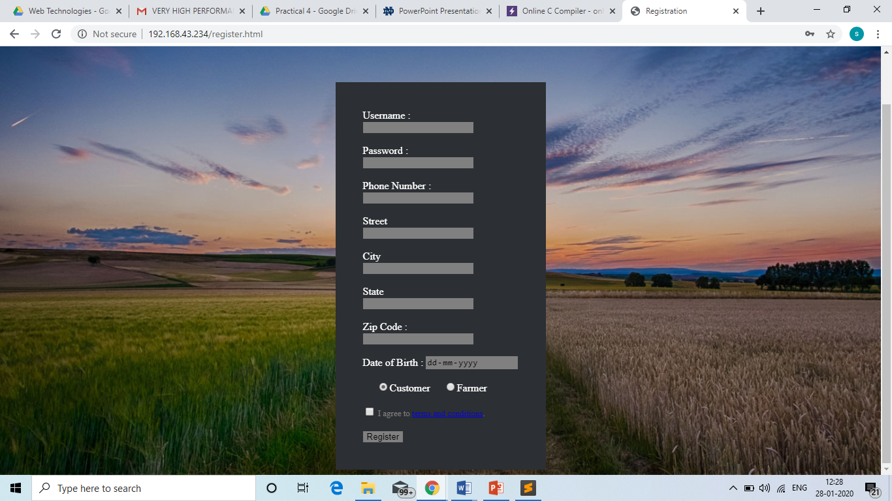
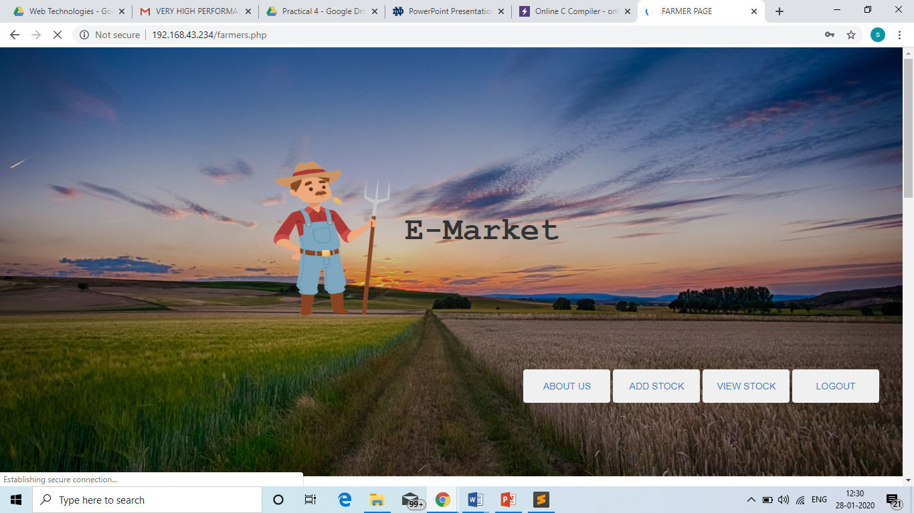
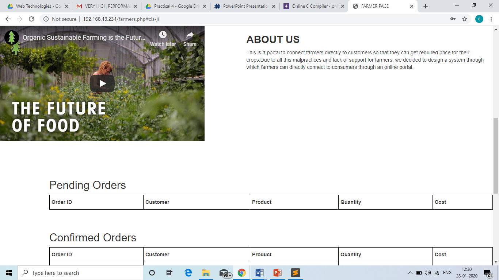
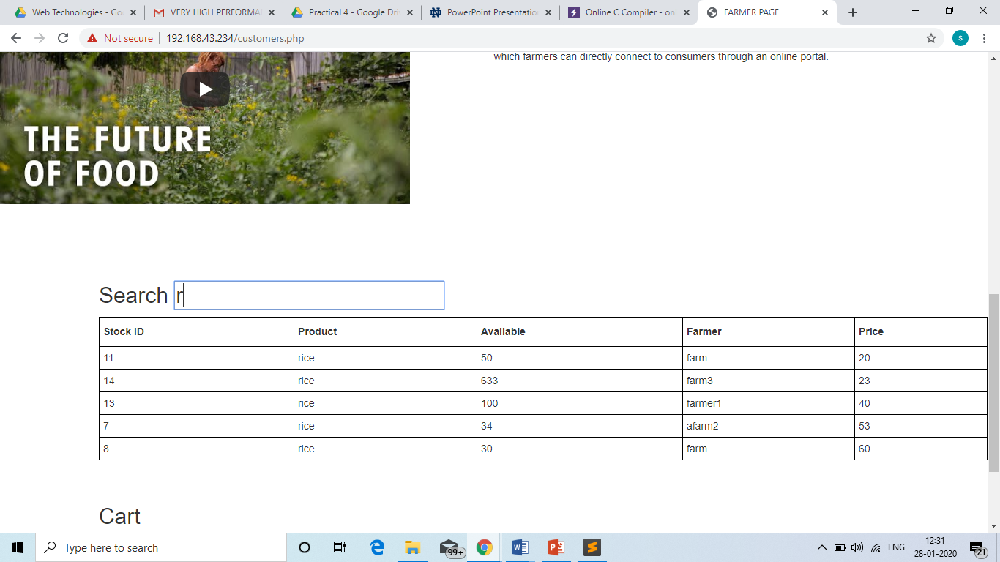
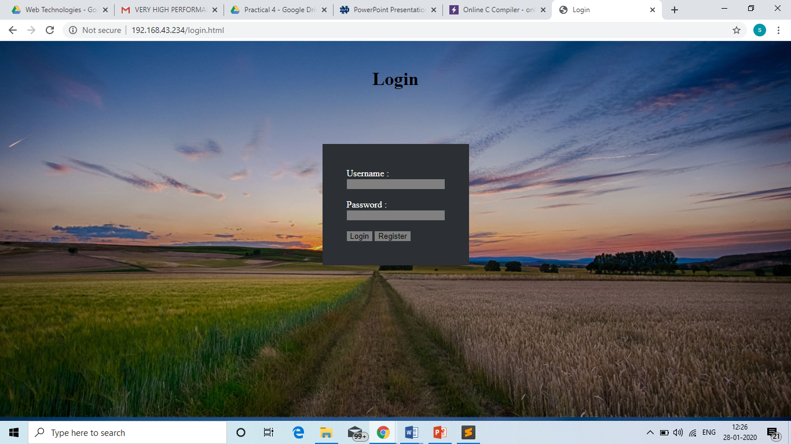

# web-technology-mini-project

We made a web portal where farmers can sell their produce and consumers can directly buy them from farmers. There are different features like add to cart, search and add stock are available.

 
 
 
 
 

Technology Stack -

PHP

HTML5

CSS3

Bootstrap

Javascript

